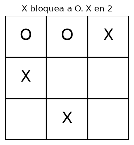

# Punto 1. Alfa–Beta para tres en raya

[1-tictactoe.ipynb](../../notebooks/alpha-beta-pruning/1-tictactoe.ipynb).

## Resultados

`X` es MAX y `O` es MIN. Victoria de `X`: `+1`. Empate: `0`. Victoria de `O`: `-1`. `visitados` cuenta cada llamada recursiva. `hojas` son estados terminales. `podas` son cortes por `α ≥ β`.

Tablero inicial. Toca `X`. Casillas libres: 6, 7 y 8.

<table>
  <tr>
    <td></td>
    <td></td>
    <td></td>
    <td></td>
  </tr>
</table>

| Tablero | Valor | Casilla de X | Minimax visitados | Minimax hojas | Alfa–Beta visitados | Alfa–Beta hojas | Podas |
| --- | ---: | ---: | ---: | ---: | ---: | ---: | ---: |
| Tres huecos | +1 | 8 | 11 | 5 | 11 | 5 | 1 |
| Vacío | 0 | 0 | 549946 | 255168 | 18297 | 7330 | 8180 |
| X cierra | +1 | 2 | 157 | 73 | 36 | 13 | 16 |
| X bloquea a O | +1 | 2 | 206 | 92 | 52 | 20 | 17 |

<table>
  <tr>
    <td></td>
    <td></td>
    <td></td>
  </tr>
</table>
