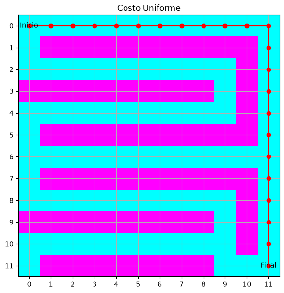
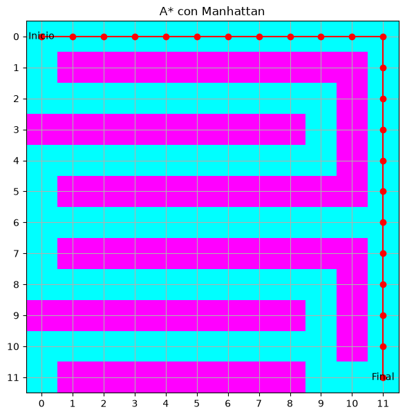
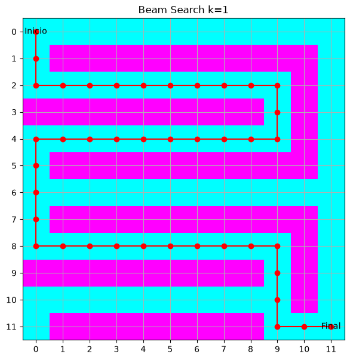
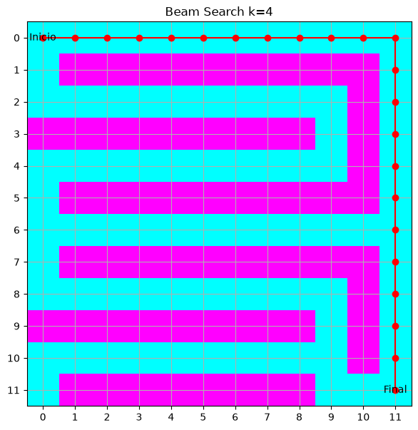

# Punto 1. Costo Uniforme, A* y Beam Search en una cuadrícula

[1-grid-search.ipynb](../../notebooks/informed-search/1-grid-search.ipynb).

## Resultados

Mapa de `12 × 12`. El `0` es celda libre y el `1` es obstáculo. El inicio está en `(0, 0)` y el objetivo en `(11, 11)`. Cada movimiento cuesta 1. `expandidos` es el número de estados que salen de la frontera. La línea roja es el camino devuelto.

Costo Uniforme ordena por `g(n)`. A* ordena por `g(n)` más distancia Manhattan. Beam Search conserva solo los `k` candidatos con menor Manhattan de cada nivel.

| Algoritmo | Costo | Expandidos | Solución |
| --- | ---: | ---: | --- |
| Costo Uniforme | 22 | 49 | Sí |
| A* | 22 | 36 | Sí |
| Beam Search k=1 | 40 | 41 | Sí |
| Beam Search k=2 | 22 | 44 | Sí |
| Beam Search k=4 | 22 | 48 | Sí |
| Beam Search k=8 | 22 | 48 | Sí |

<table>
  <tr>
    <td></td>
    <td></td>
    <td></td>
  </tr>
  <tr>
    <td></td>
    <td></td>
    <td></td>
  </tr>
</table>

Costo Uniforme y A* encuentran el mismo camino de costo 22. A* expande 36 estados y Costo Uniforme 49. Beam Search con `k = 1` también llega, pero por un camino de costo 40: el haz se queda en el corredor que se ve cerca del objetivo y pierde el rodeo óptimo. Con `k = 2` o más el haz alcanza el costo 22.
