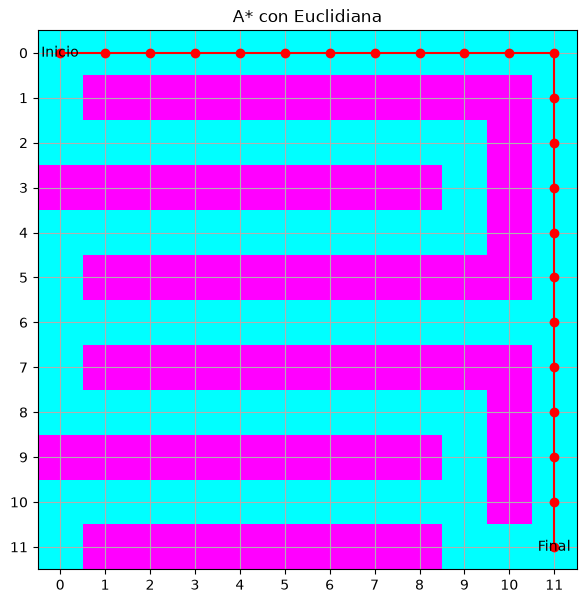

# Punto 2. Heurísticas para A*

[2-heuristics.ipynb](../../notebooks/informed-search/2-heuristics.ipynb).

## Resultados

Mismo mapa de `12 × 12` que el punto 1. A* usa `f(n)=g(n)+h(n)`. Las dos heurísticas son admisibles en una cuadrícula de 4 vecinos y costo 1. `expandidos` es el número de estados que salen de la frontera. La línea roja es el camino.

| Heurística | Costo | Expandidos | Tiempo |
| --- | ---: | ---: | ---: |
| Manhattan | 22 | 36 | 0.082 ms |
| Euclidiana | 22 | 37 | 0.066 ms |

<table>
  <tr>
    <td></td>
    <td></td>
  </tr>
</table>
