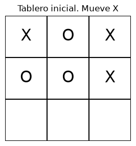
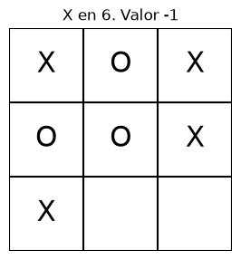
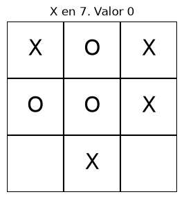
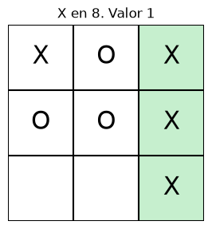
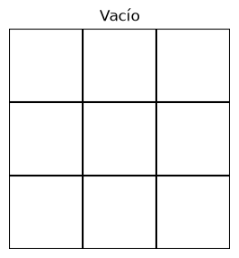
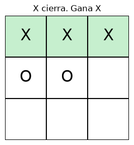

# Punto 1. Minimax para tres en raya

[1-tictactoe.ipynb](../../notebooks/minimax/1-tictactoe.ipynb).

## Resultados

`X` es MAX y `O` es MIN. Victoria de `X`: `+1`. Empate: `0`. Victoria de `O`: `-1`. El tablero es una tupla de 9 casillas. El espacio es una casilla vacía. El árbol parte de un tablero con tres huecos. Las hojas son terminales. `accion` es el índice de la casilla, de 0 a 8, de izquierda a derecha y de arriba a abajo.

Tablero inicial. Toca `X`. Casillas libres: 6, 7 y 8.

<table>
  <tr>
    <td></td>
    <td></td>
    <td></td>
    <td></td>
  </tr>
</table>

Cálculo a mano:

- `B` (X en 6): `min(-1, 0) = -1`. Si O juega en 7 completa la columna del medio.
- `C` (X en 7): `min(+1, 0) = 0`. MIN elige el empate.
- `D` (X en 8): `+1`. Columna derecha de X. Terminal.
- `A`: `max(-1, 0, +1) = +1`

Python sobre el árbol nombrado y sobre el tablero real coincide: valor `+1`, jugada `D`, casilla 8.

| Acción de X | Valor Minimax |
| --- | ---: |
| 6 | -1 |
| 7 | 0 |
| 8 | +1 |

Otros tableros:

| Tablero | Valor | Casilla de X |
| --- | ---: | ---: |
| Vacío | 0 | 0 |
| X cierra | +1 | 2 |
| X bloquea a O | +1 | 2 |

<table>
  <tr>
    <td></td>
    <td></td>
    <td></td>
  </tr>
</table>

En el tablero vacío las nueve primeras jugadas valen 0: con juego perfecto hay empate. En "X cierra" la casilla 2 gana al momento; la figura muestra las tres X de la fila de arriba. 5 empata y el resto pierde. En "X bloquea a O" la amenaza está en 2. La figura ya pone la X ahí: O no puede cerrar la fila. Esa jugada no hace tres en raya de X; cualquier otra deja que O gane y vale `-1`. Tras tapar, Minimax sigue dando `+1` porque X puede forzar la victoria.
