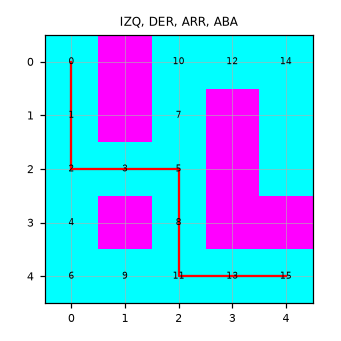
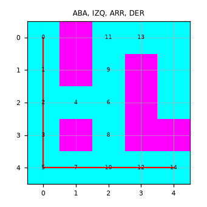
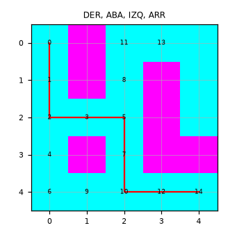

# Punto 1. Orden de movimientos en DFS

[1-movement-comparison.ipynb](../../notebooks/uninformed-search/1-movement-comparison.ipynb).

## Resultados

DFS con pila. La celda se marca al descubrirla y la búsqueda para al sacar la meta. El último sucesor insertado es el primero que se examina. `explorados` es el número de celdas descubiertas en ese momento. El número sobre cada celda es el paso de expansión. La línea roja es el camino devuelto.

| Orden de sucesores | Pasos | Explorados | Tiempo |
| --- | ---: | ---: | ---: |
| IZQ, DER, ARR, ABA | 8 | 18 | 0.031 ms |
| IZQ, ARR, ABA, DER | 8 | 12 | 0.022 ms |
| ABA, IZQ, ARR, DER | 8 | 17 | 0.039 ms |
| DER, ABA, IZQ, ARR | 8 | 18 | 0.036 ms |

<table>
  <tr>
    <td></td>
    <td></td>
    <td></td>
    <td></td>
  </tr>
</table>

Los cuatro órdenes cuestan 8 pasos. El tiempo no distingue eficiencia: las cuatro corridas quedan por debajo de 0.1 ms. En estados la diferencia sí se ve, 12, 17 o 18 celdas descubiertas. Con IZQ, ARR, ABA, DER la primera rama llega a la meta y DFS se detiene; en la figura solo aparecen los pasos de ese camino. Con IZQ, DER, ARR, ABA y con DER, ABA, IZQ, ARR la pila entra al corredor de arriba, numera ese callejón y después saca la meta por la fila de abajo. Cambiar el orden no abarata el camino en este laberinto; cambia qué rama se examina primero y cuántas celdas se marcan antes de parar.
