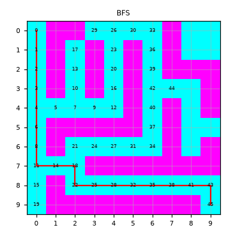
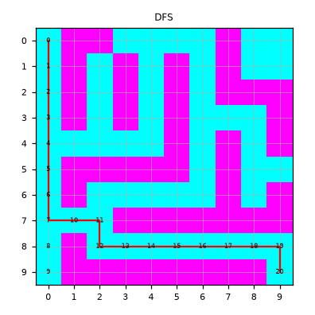

# Punto 2. Longitud del camino y estados con BFS y DFS

[2-bfs-dfs-comparison.ipynb](../../notebooks/uninformed-search/2-bfs-dfs-comparison.ipynb).

## Resultados

Mismo laberinto y mismo orden de sucesores: izquierda, derecha, arriba, abajo. BFS usa cola. DFS usa pila. `explorados` cuenta celdas descubiertas al sacar la meta. El número de la figura es el paso de expansión. La línea roja es el camino.

| Algoritmo | Pasos | Explorados | Expandidos |
| --- | ---: | ---: | ---: |
| BFS | 18 | 47 | 46 |
| DFS | 18 | 23 | 21 |

<table>
  <tr>
    <td></td>
    <td></td>
  </tr>
</table>

Los dos caminos miden 18 pasos. La diferencia de eficiencia está en el trabajo: DFS descubre 23 celdas y BFS 47. En la figura se ve el comportamiento. BFS numera casi todo el laberinto antes de llegar a la meta. DFS numera una sola rama.
